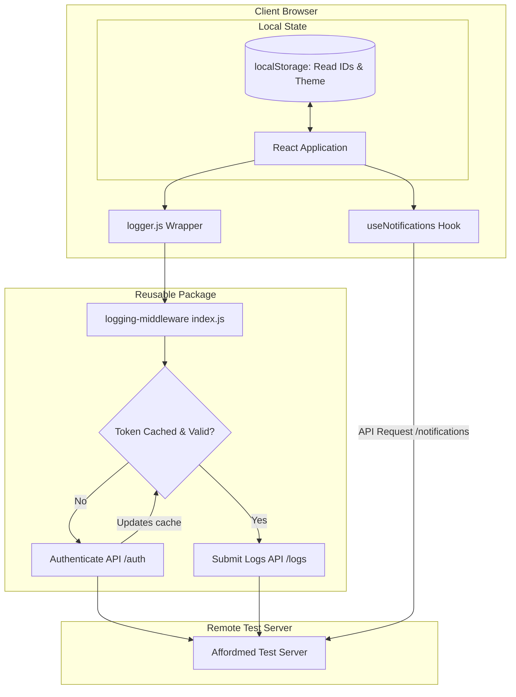

# Campus Notification System Design

This document details the system design, architectural flow, and key implementation decisions made for the Campus Notification Portal and its integrated reusable Logging Middleware.

---

## 1. System Architecture & Flow

The system consists of a single-page React frontend application communicating with a remote test server for notifications and logging. Authentication is handled dynamically through the logging middleware.

### Flow Walkthrough
1. **Application Boot:** The application initializes the theme and reads user-read notification states from `localStorage`.
2. **Data Retrieval:** The `useNotifications` hook calls `fetchNotifications(page, limit)`. It requests the Bearer token from the middleware, adds it to the headers, and sends a GET request to `/notifications`.
3. **Logging:** During major lifecycle events (page load, navigation, filtering, read status changes), components invoke the `Log` function. The middleware validates the inputs against constraints, verifies token validity (refreshing it via POST to `/auth` if expired), and sends the payload to POST `/logs`.

---

## 2. Key Design Decisions

### A. Client-Side Read/Unread State Management
*   **Problem:** The server-side `/notifications` endpoint is read-only and does not track which candidate has read which notification.
*   **Solution:** We implement client-side persistence using `localStorage`. When a notification card is clicked, its UUID is appended to a list of read IDs stored in the browser. 
*   **Benefits:** Candidates see persistent read states even after page refreshes, and we do not require a separate database.

### B. Client-Side Type Filtering
*   **Problem:** API probes revealed that querying with `type=Event` or `Type=Event` does not filter records on the server.
*   **Solution:** The application retrieves the complete paginated feed of 10 items for the current page and filters them in-memory before rendering.
*   **Benefits:** Offloads work from the server and guarantees fast, responsive tab switching.

### C. Self-Healing Authentication Cache
*   **Problem:** Tokens have a short lifetime and hardcoded values expire quickly, causing network requests to fail.
*   **Solution:** The reusable middleware parses the expiration timestamp (`exp`) of the cached JWT. It automatically performs a credentials login to `/auth` in the background before a token expires. If a call still fails with a `401 Unauthorized`, it invalidates the cache and retries the call once.
*   **Benefits:** Zero network request failures due to expired credentials.

---

## 3. Logging Strategy & Input Validation

The logging middleware enforces validation to prevent garbage logs from hitting the endpoint:
*   **Normalisation:** All inputs (stack, level, package) are converted to lowercase.
*   **Validation:** 
    *   **Stack:** Strictly checks for `"frontend"` or `"backend"`.
    *   **Level:** Validates against `"debug"`, `"info"`, `"warn"`, `"error"`, `"fatal"`.
    *   **Package:** Enforces stack-specific allowed packages (e.g. `"api"`, `"component"`, `"hook"`, `"page"`, `"state"`, `"style"`, `"utils"`).

---

## 4. UI/UX & Styling Aesthetics

We have implemented a modern, glassmorphic layout using **Material UI (MUI)**:
*   **Dynamic Theme Toggle:** Supports light and dark mode with persistent user choice.
*   **Interactive Cards:** Notification items are styled with custom borders and background hues based on their category (`Result` is green, `Placement` is blue, `Event` is orange). Cards feature micro-animations on hover (subtle vertical translate and drop shadows).
*   **Visual Badging:** Unread notifications feature a vibrant blue notification badge and a "New" chip, making urgent updates stand out immediately.
